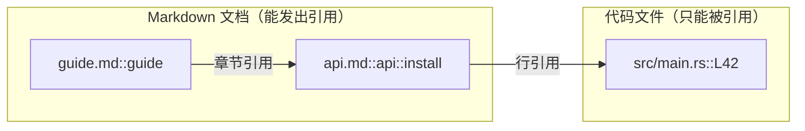
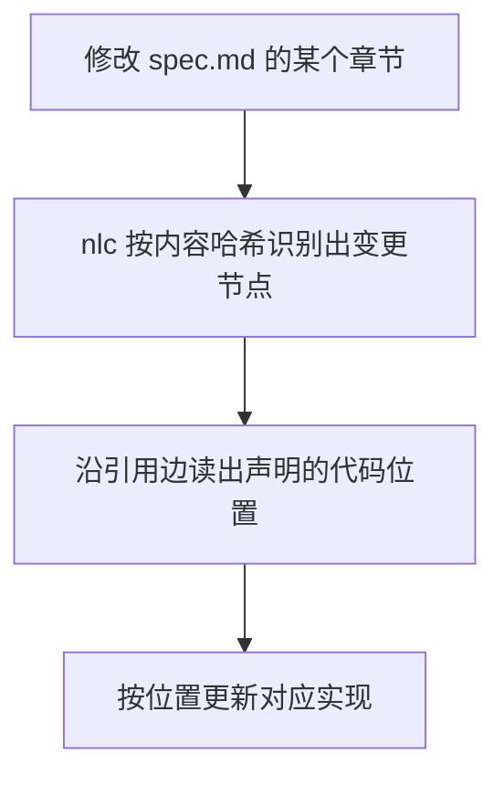
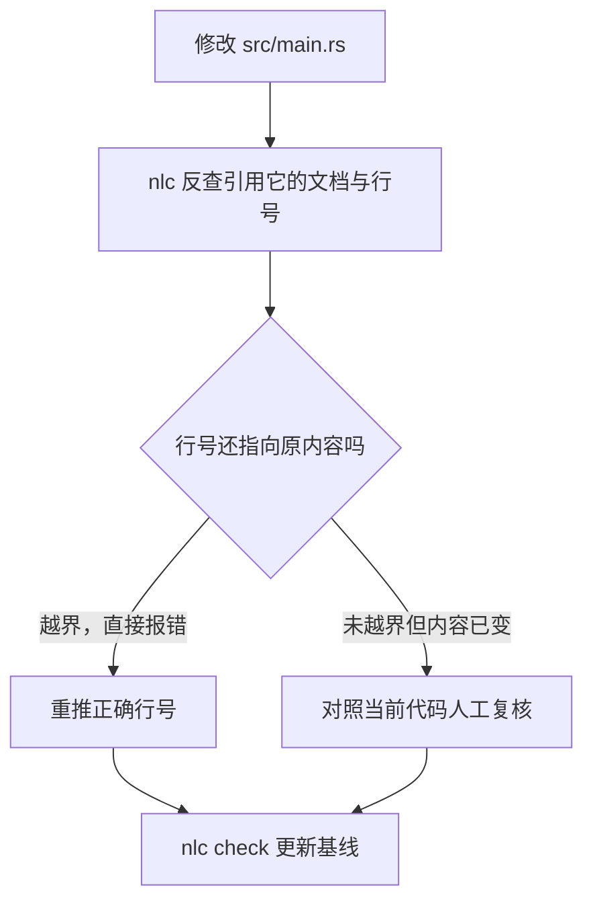
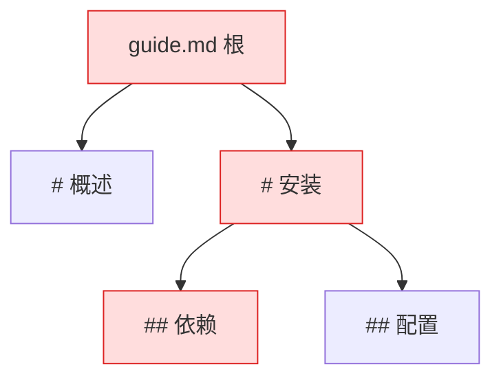

# nlc

nlc 是一个 Markdown 依赖追踪工具。文档用 `[[...]]` 引用其他文档的章节和代码的具体行，nlc 把这些引用解析成一张有向图，校验每条边，追踪每次变更：文档改了，它指出该同步哪几行代码；代码改了，它指出哪些文档引用已经失效。

## 它解决什么问题

文档和代码各自演进，一致性靠人维护。A 文档提到 B 文档的某一节，提到 src/main.rs 的第四十二行，链接断没断、代码改没改，没有工具负责回答。nlc 把这类引用显式写进文档，让工具接管校验和追踪。

## 引用显式化

每个节点有稳定 ID 和内容哈希。引用的完整写法：

| 写法 | 指向 |
|---|---|
| `[[guide.md]]` | 整篇文档 |
| `[[guide]]` | 整篇文档，`.md` 可省略 |
| `[[guide.md#Setup]]` | 指定章节 |
| `[[#Setup]]` | 同一文档内的章节 |
| `[[guide.md#L12]]` | 文档的某一行，按整篇文档的依赖计 |
| `[[src/main.rs#L42]]` | 代码文件的某一行 |
| `[[src/main.rs#L10-L20]]` | 代码文件的行区间 |
| `[[src/main.rs#L42\|入口]]` | 竖线后是别名，只改变显示 |

引用指向章节时按标题的 slug 匹配，只比最后一级。两个不同父章节下的标题 slug 相同，引用就报「歧义章节」。代码文件没有章节，只接受 `#L<行>` 和 `#L<起>-L<止>` 的定位，写名字会报错。

工作区内所有 Markdown 文档都会被扫描，遵循 .gitignore。任何非 `.md` 的可读文本文件（.rs、.py、Makefile 等）都能被引用，只校验存在与行号，不参与哈希和缓存。

解析出的引用构成有向图。引用都从 Markdown 节点发出，落在其他文档或代码行上；代码节点没有出边。悬空路径、找不到章节、行号越界、循环依赖都按错误处理，退出码 1，和 make 对循环依赖的态度一致。图必须始终可信，后续的追踪才有意义。



## 从文档改动同步到代码



## 从代码改动同步到文档

代码挪动会让文档里的 `#L42` 指向旧位置。nlc 能查出哪些文档受影响，但按行号定位这件事有边界，图里标出要人工接手的部分。



## 增量与缓存

nlc 把上次 `nlc check` 的结果记在工作区根目录的 `.nlc-cache`。每篇文档的哈希是分层的，子章节的改动会连带改变所有祖先的哈希，所以只报相对缓存的差异。



改动落在「## 依赖」时，它和所有祖先（# 安装、guide.md 根）的哈希都变，被标为 changed；兄弟节点「## 配置」「# 概述」不受影响。

状态报告把节点分成三类：

- changed：内容相对缓存发生了变化
- affected：自身没变，但依赖的节点变了，需要连带复核
- up-to-date：与缓存一致

报告只列 changed 和 affected 节点上的问题；`--full` 覆盖所有节点。结尾给出 `ok` 或错误数，以及两次运行之间由坏转好、由好转坏的节点。

## 边界

nlc 追踪的是引用的位置，有两件事它不负责：

1. 它按行号定位代码，同一行的内容变了它看不见，语义级的比对靠人或 agent。
2. 它指出谁受影响，不判断该怎么改。

## 命令

| 命令 | 作用 |
|---|---|
| `nlc status` | 只报有变更或受影响的节点 |
| `nlc check` | 报告同上，并把 `.nlc-cache` 落盘，作为下次比对的基线 |
| `nlc tree <file>` | 一篇文档的节点树，递归展开依赖链 |
| `nlc graph` | 打印全部引用边 |
| `nlc list [<file>]` | 打印章节大纲 |
| `nlc clean` | 删除缓存，下次回到全量报告 |
| `nlc ast <file>` | 调试用，打印解析后的 AST |

`--full` 只适用于 status 和 check。各命令的参数与退出码见 `nlc <command> --help`。

## 常见错误与修复

| 报错关键词 | 原因 | 修法 |
|---|---|---|
| references missing file | 路径没有匹配到任何文档或代码文件 | 改路径，或补建文件 |
| references missing section | 标题 slug 匹配不到章节 | 改标题，或改引用 |
| ambiguous section | 不同父章节下有相同 slug 的标题 | 改标题，或写更具体的引用 |
| line … which has only N line(s) | 行号或行区间超出文件范围 | 按当前代码重排行号 |
| only support #L<line> | 对代码文件用了名字引用 | 改成 `#L<行>` |
| circular dependency | 引用成环 | 断开环 |

## 构建与开发

需要 Rust 1.85 以上，代码用到 edition 2024 的 let-chains。

```sh
cargo build
cargo test
cargo clippy --all-targets   # 必须零警告
```

仓库分两个 crate：

- `nlc-parser/`：Markdown 解析库。语法用 LALRPOP 写在 `src/parser_block.lalrpop` 和 `src/parser_inline.lalrpop`，构建时生成同名 `.rs` 文件，两者都入库；改语法要连同生成的 `.rs` 一起提交，不要手改生成文件。
- `nlc/`：命令行本体。每次运行构建一个快照，流水线是 collect → graph → hash → 缓存比对；每个子命令是 `src/printer/` 下的一个渲染器。

`.nlc-cache` 是运行时产物，已列入 .gitignore。提交遵循 Conventional Commits，每个提交独立通过测试和 clippy，细节见 AGENTS.md。

`tests/workspace/` 下有一个完整的示例知识库，可对照上手。在 agent 工作流中使用，参考 `.agents/skills/nlc/SKILL.md`。
